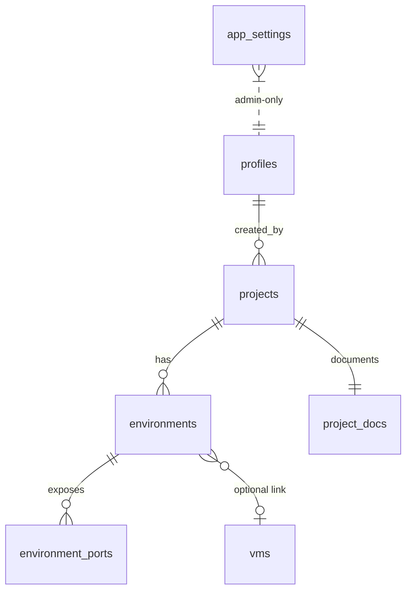

# Phase 2 — Deployment Management Platform

Phase 2 grows the VM Migration Tracker into an internal **deployment
management platform**: a dashboard of all our projects, their environments,
CI/CD wiring (Jenkins / AWS / Azure / Amplify), deployed ports, per-project
rich-text documentation with AI generation, and role-based access. The
existing VM tracker stays as-is; it becomes the infrastructure source that
environments can optionally link to.

> **This plan is binding on all Phase 2 work.** Every issue below must follow
> the rules in [../AGENTS.md](../AGENTS.md) and the docs it points to. See
> [§9 Rules & conventions](#9-rules--conventions-must-follow) — do not skip it.

---

## 1. Locked decisions

These were decided up front; the whole plan depends on them.

| # | Decision | Chosen |
| - | -------- | ------ |
| 1 | Data model | **Flat Projects → Environments.** VM tracker stays a separate module; an environment may optionally reference a VM. `client` (CHEX/INAI/KOMPETE/UPVIEW) is a **tag/filter** on projects, not a hierarchy table. |
| 2 | Jenkins | **Manual CRUD first (Phase 2a); auto-sync later (Phase 2b).** |
| 3 | Gemini AI key | **Single global key**, configured by an admin, stored server-side, never exposed to the browser. |
| 4 | Permissions | **Global role per user:** `admin`, `editor`, `viewer`. No self-signup — admins provision users by email and assign a role. |

---

## 2. Roles & access model

Three global roles, stored on `profiles.role`:

| Capability | viewer | editor | admin |
| ---------- | :----: | :----: | :---: |
| View dashboard, projects, environments, docs, ports | ✅ | ✅ | ✅ |
| Edit projects / environments / ports / docs | — | ✅ | ✅ |
| Run "Generate by AI" | — | ✅ | ✅ |
| Create / delete projects | — | — | ✅ |
| Manage users (add by email, set role, remove) | — | — | ✅ |
| Configure app settings (Gemini key, later Jenkins) | — | — | ✅ |

**No self-signup.** Today `signInWithOtp` runs with `shouldCreateUser: true`
([../repositories/auth/authRepository.ts](../repositories/auth/authRepository.ts)).
Phase 2 sets it to `false`, so only pre-provisioned users can sign in. Admins
add a user by email; a server route using the **service-role client**
(`lib/supabase/service.ts`) creates/invites the auth user and upserts the
`profiles` row with the chosen role. The `on_auth_user_created` trigger still
creates the base `profiles` row; the admin flow sets `role`.

Enforcement is **defense-in-depth**: role-based RLS in Postgres (authoritative)
**plus** service-layer checks **plus** role-aware UI (hide/disable controls).

---

## 3. Data model

New tables live in Supabase and are created **only** via Supabase CLI
migrations (`supabase migration new …`, then `supabase db push`), one migration
per change, with [schema.md](./schema.md) updated to match
([§9](#9-rules--conventions-must-follow)).

### 3.1 `profiles` (extend existing)

Add:

```
role text not null default 'viewer'
  check (role in ('admin','editor','viewer'))
```

Plus a `SECURITY DEFINER` helper used by every policy:

```sql
create or replace function public.current_user_role()
returns text language sql stable security definer set search_path = '' as $$
  select role from public.profiles where id = auth.uid();
$$;
```

### 3.2 `projects`

| column | type | notes |
| ------ | ---- | ----- |
| `id` | `uuid` pk | `gen_random_uuid()` |
| `name` | `text` | e.g. `chex-api` |
| `slug` | `text` unique | url-safe |
| `client` | `text` | tag for grouping/filtering (CHEX/INAI/KOMPETE/UPVIEW/…); free text |
| `description` | `text` | short summary |
| `repo_url` | `text` | optional |
| `cicd_provider` | `text` | `check in ('jenkins','aws','azure','amplify','other','none')` — default provider; env can override |
| `archived` | `boolean` | soft delete (mirrors tracker) |
| `archived_at` | `timestamptz` | |
| `created_by` | `uuid` | fk → `auth.users` |
| `created_at` / `updated_at` | `timestamptz` | `set_updated_at` trigger |

### 3.3 `environments`

| column | type | notes |
| ------ | ---- | ----- |
| `id` | `uuid` pk | |
| `project_id` | `uuid` | fk → `projects` `on delete cascade` |
| `name` | `text` | dev / staging / prod / custom |
| `cicd_provider` | `text` | same check set; overrides project default |
| `jenkins_url` | `text` | Jenkins job URL (nullable when provider ≠ jenkins) |
| `deploy_url` | `text` | live/deployed URL or domain |
| `vm_id` | `uuid` null | fk → `vms(id)` `on delete set null` — optional link to a VM (existing or created inline; see below) |
| `notes` | `text` | |
| `position` | `integer` | display order within a project |
| `created_at` / `updated_at` | `timestamptz` | `set_updated_at` trigger |

**VM selection — pick existing or create inline.** When adding/editing an
environment, the VM field is a searchable picker over the existing `vms` rows.
If the target VM doesn't exist yet, the same form can **create a new VM**
(name, `old_ip`/`new_ip`, `is_client`, etc.) which is inserted into `vms` and
immediately linked via `vm_id`. The environment service reuses the existing
`vmService`/`vmRepository` (no duplicate VM write path), so a VM created here
also shows up in the VM tracker. `vms` stays the single source of truth for
infrastructure.

### 3.4 `environment_ports`

One row per deployed port (mirrors the `vm_urls` child-table pattern; also the
target shape for Jenkins-synced ports in Phase 2b).

| column | type | notes |
| ------ | ---- | ----- |
| `id` | `uuid` pk | |
| `environment_id` | `uuid` | fk → `environments` `on delete cascade` |
| `port` | `text` | e.g. `3000` |
| `protocol` | `text` | `check in ('HTTP','HTTPS','TCP','UDP','WS','WSS')` default `HTTPS` |
| `description` | `text` | e.g. "API", "metrics" |
| `source` | `text` | `check in ('manual','jenkins')` default `manual` (Phase 2b provenance) |
| `position` | `integer` | |
| timestamps | | `set_updated_at` trigger |

### 3.5 `project_docs`

One row per project (1-to-1). Tiptap document, stored as both JSON (canonical,
re-editable) and HTML (cheap render for viewers).

| column | type | notes |
| ------ | ---- | ----- |
| `project_id` | `uuid` pk | fk → `projects` `on delete cascade` |
| `content_json` | `jsonb` | Tiptap document JSON |
| `content_html` | `text` | rendered HTML |
| `generated_by_ai` | `boolean` | last save came from AI generation |
| `updated_by` | `uuid` | fk → `auth.users` |
| `updated_at` | `timestamptz` | `set_updated_at` trigger |

### 3.6 `app_settings`

Singleton (one row, `id = true` boolean pk) for admin-configured global values.

| column | type | notes |
| ------ | ---- | ----- |
| `id` | `boolean` pk | `default true check (id)` — enforces single row |
| `gemini_api_key` | `text` | **secret** — see [§7](#7-secrets-handling) |
| `gemini_model` | `text` | default e.g. `gemini-2.5-flash` |
| `ai_style_prompt` | `text` | house-style instructions for consistent docs |
| `jenkins_base_url` | `text` | Phase 2b |
| `jenkins_username` | `text` | Phase 2b |
| `jenkins_api_token` | `text` | Phase 2b — **secret** |
| timestamps | | |

### 3.7 RLS (all new tables)

- **profiles**: user reads own row; admin reads/updates all (via
  `current_user_role() = 'admin'`).
- **projects / environments / environment_ports / project_docs**:
  - `select` → any authenticated user (viewer+).
  - `insert` / `update` → `current_user_role() in ('editor','admin')`.
  - `delete` → `current_user_role() = 'admin'` (project delete is admin-only;
    editors soft-archive instead).
- **app_settings**: `select` + `update` → `current_user_role() = 'admin'` only.
  The AI/Jenkins server routes read secrets with the **service-role** client so
  the key never travels to the browser.

### 3.8 Entity diagram



---

## 4. Feature slices → 5-layer mapping

Every feature is a vertical slice through routing → UI → hooks → services →
repositories (see [architecture.md](./architecture.md)). Reference wiring:

| Feature | Routing (`app/`) | UI (`components/`) | Hook (`hooks/`) | Service (`services/`) | Repository (`repositories/`) |
| ------- | ---------------- | ------------------ | --------------- | --------------------- | ---------------------------- |
| RBAC / session role | — | — | — | `auth/authService` (+`getCurrentRole`) | `profiles/profileRepository` |
| User management | `app/api/users/**`, `app/(protected)/admin/users/page.tsx` | `components/users/*` | `hooks/users/useUsers.ts` | `services/users/userService.ts` | `repositories/users/userRepository.ts` (service-role) |
| Projects dashboard | `app/api/projects/**`, `app/(protected)/dashboard/page.tsx` | `components/projects/*` | `hooks/projects/useProjects.ts` | `services/projects/projectService.ts` | `repositories/projects/projectRepository.ts` |
| Project detail + envs | `app/api/projects/:id/environments/**`, `app/(protected)/projects/[id]/page.tsx` | `components/environments/*` | `hooks/environments/useEnvironments.ts` | `services/environments/environmentService.ts` (reuses `vms/vmService` for inline VM create) | `repositories/environments/*`, `repositories/environmentPorts/*`, `repositories/vms/*` (existing) |
| Documentation | `app/api/projects/:id/docs/**` | `components/docs/*` (Tiptap) | `hooks/docs/useProjectDoc.ts` | `services/docs/docService.ts` | `repositories/projectDocs/*` |
| AI generation | `app/api/ai/generate-docs/route.ts` | `components/docs/generate-button.tsx` | `hooks/ai/useGenerateDocs.ts` | `services/ai/aiService.ts` | `repositories/appSettings/*` (read key) |
| App settings | `app/api/settings/**`, `app/(protected)/admin/settings/page.tsx` | `components/settings/*` | `hooks/settings/useAppSettings.ts` | `services/settings/settingsService.ts` | `repositories/appSettings/*` |
| Jenkins sync (2b) | `app/api/jenkins/sync/route.ts` | `components/settings/jenkins-*` | `hooks/jenkins/useJenkinsSync.ts` | `services/jenkins/jenkinsService.ts` | `repositories/jenkins/jenkinsRepository.ts` (external HTTP) |

Reminders: components never import services/repositories; hooks call API
routes/services, never repositories; repositories only touch Supabase (except
the Jenkins repo, which is the one external-HTTP data source).

---

## 5. UI / UX

**Principles:** simplistic, calm, spreadsheet-clean like the tracker; shadcn
only; dark mode first-class. Group/filter projects with a tab bar that mirrors
the Jenkins client tabs (All / CHEX / INAI / KOMPETE / UPVIEW), derived from
distinct `client` values.

### 5.1 App shell

- Role-aware protected layout ([app/(protected)/layout.tsx](../app/(protected)/layout.tsx)):
  sidebar/topnav with **Dashboard**, **Projects**, and (admin-only) **Users**
  and **Settings**; a VM **Tracker** link; user menu with role badge + logout.
- Dark-mode toggle via `next-themes` + a shadcn dropdown/switch. (`next-themes`
  is a theme provider, not a component library — it does not violate the
  shadcn-only rule.)

### 5.2 Dashboard

- Client filter tabs + search (shadcn `command`/`input`) + `cicd_provider`
  filter.
- Project **cards**: name, client badge, provider badge, env count, port count,
  last-updated. Click → project detail. Admin sees **+ New Project** and
  card actions (edit/delete via `alert-dialog`).

### 5.3 Project detail

- Header: name, client, provider, repo link, edit (editor+), delete (admin).
- **Environments** section: one block per env (dev/staging/prod) showing
  Jenkins URL, deploy URL, linked VM (deep-link into tracker), and a **ports**
  table. Editors get inline add/edit; local-first editing like the tracker
  where it helps.
- **VM picker (existing or new).** The env form's VM field is a
  searchable combobox over `vms`; a "**+ Create new VM**" option opens an
  inline form (name, old/new IP, client flag) that inserts into `vms` via the
  existing `vmService` and links it. New VMs also appear in the VM tracker.
- **Documentation** tab: Tiptap editor (editor+) / read-only rendered HTML
  (viewer), with the **Generate by AI** button.

### 5.4 shadcn primitives to add

Install via `npx shadcn@latest add <c>` only (per
[ui-guidelines.md](./ui-guidelines.md)); never hand-roll or paste:

```
dialog  alert-dialog  dropdown-menu  select  tabs  table  badge
textarea  switch  tooltip  sonner  avatar  separator  sheet
skeleton  form  command  breadcrumb
```

(`button`, `card`, `input`, `label` already exist.)

---

## 6. Documentation editor (Tiptap)

- Engine: **Tiptap** (`@tiptap/react`, `@tiptap/starter-kit`, `@tiptap/pm`) —
  a headless editor, not a UI component library, so it is compatible with the
  shadcn-only rule. The toolbar is built from **shadcn** buttons/toggles/
  dropdowns; content is styled with theme tokens (`prose` via
  `@tailwindcss/typography` mapped to `foreground`/`muted` tokens, light+dark).
- Persist Tiptap **JSON** (`content_json`) as canonical and render **HTML**
  (`content_html`) for fast read-only viewing.
- Viewers get the rendered HTML only (no editor bundle needed).

---

## 7. AI documentation generation (Gemini)

- Admin saves the Gemini key + model + house-style prompt in **App Settings**.
- Flow: **Generate by AI** → `useGenerateDocs` → `POST /api/ai/generate-docs`
  → `aiService` reads the key server-side (service-role repo), builds a prompt
  from the project's structured data (name, client, provider, environments,
  ports, VM links, existing notes) **plus** `ai_style_prompt` for a consistent
  house style → calls Gemini (`@google/genai`) → returns Tiptap-compatible
  content the editor loads (editable before save; sets `generated_by_ai`).
- The key **never** reaches the browser; all Gemini calls are server-side.
- Consistent style: one shared system/style prompt + a fixed section skeleton
  (Overview / Architecture / Environments / Deployment / Ports / Runbook).

### Secrets handling

- `gemini_api_key` / `jenkins_api_token` are secrets. Prefer **Supabase Vault**
  or pgcrypto for at-rest encryption; at minimum, `app_settings` is admin-only
  RLS and secrets are read **only** by server routes via the service-role
  client. Never `NEXT_PUBLIC_`, never returned in any client payload (mask as
  `••••` in the settings UI; write-only field).
- MVP fallback allowed: read the Gemini key from a server env var
  (`GEMINI_API_KEY`) if `app_settings` is empty.

---

## 8. Milestones & GitHub issues

Each issue is a vertical slice with its own migration(s) where noted, and must
finish green on `npm run build` + `npm run lint`. **Epic → issues:**

### Milestone M1 — Phase 2a: core platform

| ID | Issue | Migrations | Depends on |
| -- | ----- | ---------- | ---------- |
| A1 | **RBAC schema**: `profiles.role`, `current_user_role()`, role-based RLS scaffolding | ✅ | — |
| A2 | **No self-signup + admin user provisioning**: `shouldCreateUser:false`, service-role invite/create, role upsert | — | A1 |
| A3 | **Role-aware app shell + route guards + dark mode**: protected layout nav, role badge, `next-themes` toggle, redirect guests | — | A1 |
| B1 | **Projects schema** (`projects` + RLS) | ✅ | A1 |
| B2 | **Projects dashboard**: list, client-tab filter, search, provider filter, cards | — | B1 |
| B3 | **Project create/edit/delete**: editor create/edit, admin delete, soft-archive | — | B1, B2 |
| B4 | **Environments schema** (`environments` + `environment_ports` + RLS) | ✅ | B1 |
| B5 | **Environment + ports CRUD**: per-project envs, Jenkins URL, deploy URL, `cicd_provider`, ports table, **VM picker (select existing or create a new VM inline via `vmService`)** | — | B4 |
| A4 | **User management UI (admin)**: list users, add by email, change role, remove | — | A2 |

### Milestone M2 — Documentation & AI

| ID | Issue | Migrations | Depends on |
| -- | ----- | ---------- | ---------- |
| C1 | **App settings schema + admin UI** (`app_settings`, secrets masked) | ✅ | A1 |
| C2 | **Tiptap documentation editor**: edit (editor+) / read-only (viewer), JSON+HTML persistence | ✅ (`project_docs`) | B1 |
| C3 | **Gemini AI doc generation**: `/api/ai/generate-docs`, style prompt, structured input, editable output | — | C1, C2 |

### Milestone M3 — Phase 2b: Jenkins sync

| ID | Issue | Migrations | Depends on |
| -- | ----- | ---------- | ---------- |
| D1 | **Jenkins server config** in app settings (URL, user, API token; secret handling) | — | C1 |
| D2 | **Jenkins sync**: read jobs + views via Jenkins JSON API, map jobs→projects (by `client`/view), upsert; dry-run preview + apply | — | D1, B1, B5 |
| D3 | **Best-effort port & CI/CD extraction** from job config/build metadata into `environment_ports` (`source='jenkins'`); log what couldn't be mapped | — | D2 |

### Cross-cutting

| ID | Issue | Notes |
| -- | ----- | ----- |
| E1 | **Polish**: empty/loading/error states (`skeleton`, `sonner`), a11y, responsive | applies across M1–M3 |
| E2 | **Docs upkeep**: update `schema.md`, add `docs/projects.md`, `docs/rbac.md`, `docs/ai-docs.md`, `docs/jenkins-sync.md` | one per feature slice |

**Suggested labels:** `phase-2`, `epic:foundations`, `epic:projects`,
`epic:docs-ai`, `epic:jenkins`, `migration`, `rbac`, `ui`, `backend`.

---

## 9. Rules & conventions (must follow)

Pulled from [../AGENTS.md](../AGENTS.md) and its linked docs — **non-negotiable
for every Phase 2 issue**:

1. **This is a modified Next.js.** Before writing code, read the relevant guide
   in `node_modules/next/dist/docs/` and heed deprecation notices. Don't assume
   APIs from memory.
2. **5-layer architecture** ([architecture.md](./architecture.md)): routing →
   UI → hooks → services → repositories. No layer skips another. Components
   never import services/repos. Hooks never import repos. Repos only touch
   Supabase (Jenkins repo is the lone external-HTTP exception).
3. **shadcn/ui only** ([ui-guidelines.md](./ui-guidelines.md)): check
   `components/ui/` first; install missing primitives with
   `npx shadcn@latest add <c>`; never hand-roll primitives, never paste from
   docs, never edit generated `ui/` files, icons from `lucide-react`, theme
   tokens not hardcoded colors. No other component library (Tiptap and
   `next-themes` are engines/providers, not UI kits — allowed).
4. **Database workflow** ([schema.md](./schema.md)): tables are created **only**
   via Supabase CLI migrations — `supabase migration new <name>` →
   `supabase/migrations/` → `supabase db push`. One migration per change.
   Enable RLS + policies on every new table; attach `set_updated_at` where an
   `updated_at` column exists. **Update `schema.md`** after every migration.
   Never create/alter tables from app code.
5. **Auth** ([auth.md](./auth.md)): passwordless email OTP; `app-session`
   cookie name stays consistent across `client.ts`/`server.ts`/`proxy.ts`;
   service-role client only for the rare no-session/RLS-bypass route.
6. **Secrets**: never `NEXT_PUBLIC_` a secret; never return secrets to the
   client; server-side reads only (see [§7](#7-secrets-handling)).
7. **Definition of done** (every issue): `npm run build` with **zero**
   TypeScript errors, then `npm run lint` clean.

---

## 10. Open technical risks

- **Jenkins port extraction (D3).** Jenkins jobs don't natively expose
  "deployed ports"; they live in Dockerfiles / deploy scripts / build logs.
  Extraction is best-effort (parse job config XML / last build metadata) and
  may need per-job conventions. Ship manual port entry first; treat sync as
  augmentation, and log everything it couldn't map (no silent truncation).
- **Secret encryption.** Decide Supabase Vault vs pgcrypto vs env-var-only for
  `gemini_api_key` / `jenkins_api_token` before C1/D1.
- **Existing-user check on signup** (documented limitation in
  [auth.md](./auth.md)) — resolve properly with the service-role/RPC path as
  part of A2.
- **Gemini SDK/model**: confirm the current `@google/genai` SDK and model id
  at implementation time (this plan assumes a `gemini-2.x` model).

---

## 11. Sequencing summary

```
A1 ─┬─ A2 ── A4
    ├─ A3
    └─ B1 ─┬─ B2 ── B3
           ├─ B4 ── B5
           ├─ C1 ── C3
           └─ C2 ──┘
C1 ── D1 ── D2 ── D3   (Phase 2b, after M1)
```

Build M1 first (usable dashboard + roles), then M2 (docs + AI), then M3
(Jenkins sync). E1/E2 run continuously.
